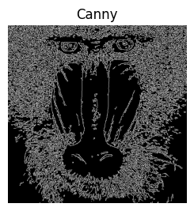
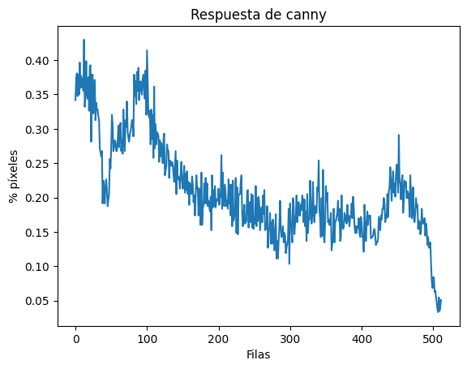
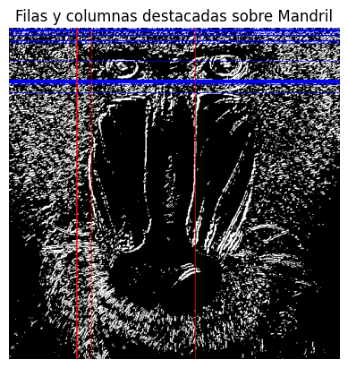
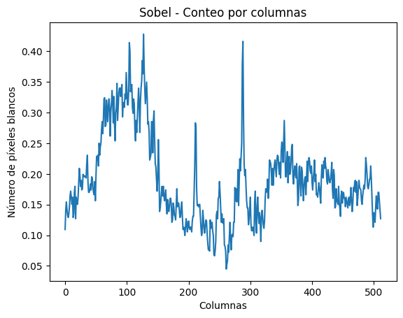
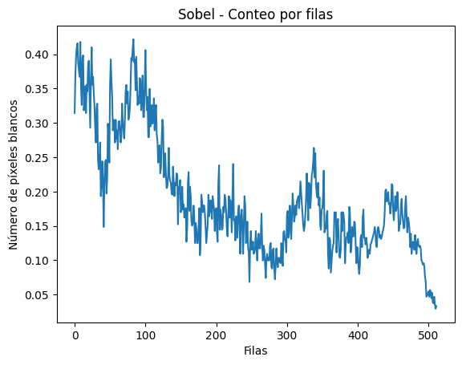
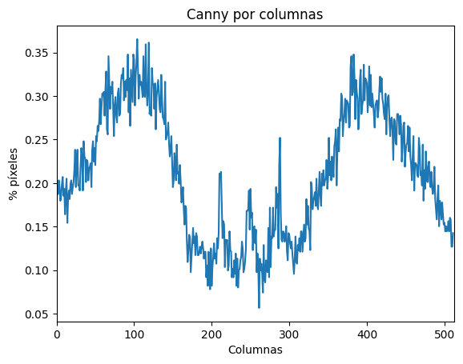
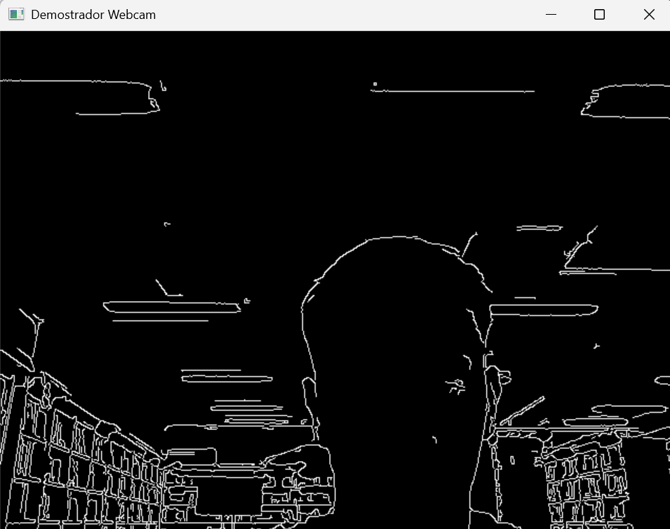
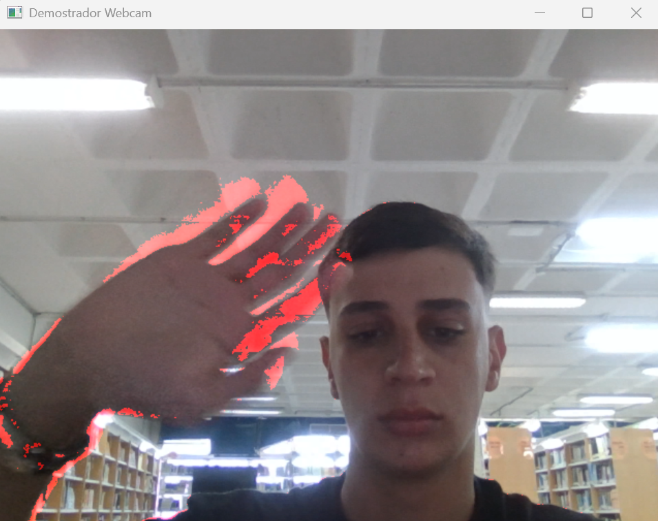
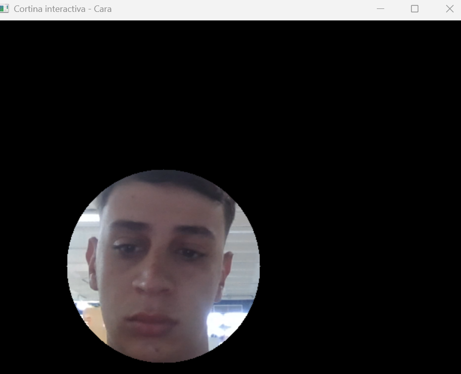

# Práctica 3 - Visión por Computador

En esta práctica seguimos realizando ejercicios de procesamiento de imágenes, aplicando técnicas vistas en clase como Canny, Sobel y detección de movimiento.

## Tarea 1

En esta tarea contamos los píxeles blancos por filas, de manera similar a cómo se hizo previamente por columnas. Utilizamos una imagen con detección de bordes mediante Canny para identificar el valor máximo de píxeles blancos en las filas y determinar cuáles superan el 90% de este máximo.

**Resultados:**
- Máximo número de píxeles blancos en filas: 0.4296875
- Filas con ≥ 90% del máximo (0.38671875 píxeles): [6, 12, 15, 20, 21, 88, 100]

---

## Tarea 2

Aquí comparamos los resultados obtenidos usando Canny y Sobel. Realizamos el conteo de valores no nulos como en el caso de Canny, y representamos mediante líneas azules y rojas las zonas con bordes horizontales y verticales más relevantes.

**Resultados Sobel:**
- Máximo columnas: 0.427734375, destacadas: [104, 105, 127, 288]
- Máximo filas: 0.421875, destacadas: [2, 3, 4, 5, 8, 11, 12, 19, 20, 24, 51, 80, 81, 82, 83, 84, 85, 87, 100]

También añadimos las imágenes de Canny para compararlas:

Se puede observar que Canny controla mejor los falsos máximos gracias a la supresión de máximos locales.

---

## Tarea 3

En esta sección propuse dos procesamientos para vídeo en tiempo real. El primero aplica la detección de bordes de Canny sobre la cámara. El segundo detecta movimiento usando una máscara roja, resaltando las zonas en movimiento sobre la imagen original.

---

## Tarea 4

Inspirado en los vídeos propuestos, creé un demostrador similar a *My Little Piece of Privacy*. En mi propuesta, un círculo sigue la cara que aparece en la cámara, mostrando la interacción de manera visual.

